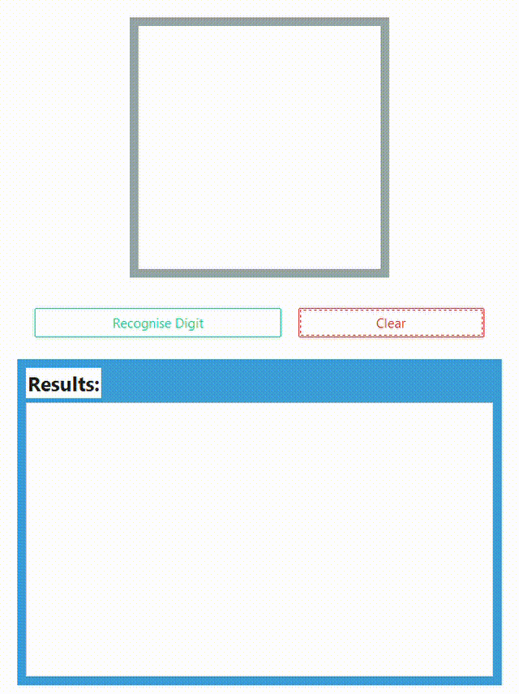

#  Handwritten Digit Recognition App

Author: Adam Bydłowski
---

An interactive desktop application that allows you to draw a handwritten digit (0–9) and receive real-time predictions from a trained **Convolutional Neural Network (CNN)**.

This project combines modern deep learning with a user-friendly GUI to demonstrate digit classification using the MNIST datasets.

---

##  Features

- **Draw digits** directly in the application window
-  **CNN-based classifier** built with PyTorch
-  Displays **prediction probabilities** for all 10 digits
-  Load and use a **pre-trained model** (`model.pth`)
-  **Polished GUI** using `Tkinter` and `ttkbootstrap`

---

##  Technologies Used

- **Python 3.11.9**
- [PyTorch] — neural network training & inference
- [ttkbootstrap] — modern GUI styling
- `Tkinter` — GUI framework
- `Pillow` — image preprocessing
- `UMAP`, `DBSCAN`, `matplotlib`, `sklearn`, `numpy` — tools for clustering & data analysis

---

##  Preview

---

##  Model Overview

The neural network is a CNN trained on MNIST/EMNIST with the following setup:
- 2 convolutional layers + max pooling
- Fully connected layers with softmax output
- Data augmentation via rotation, noise, and scaling
- Achieves ~98% accuracy on standard digits

---
